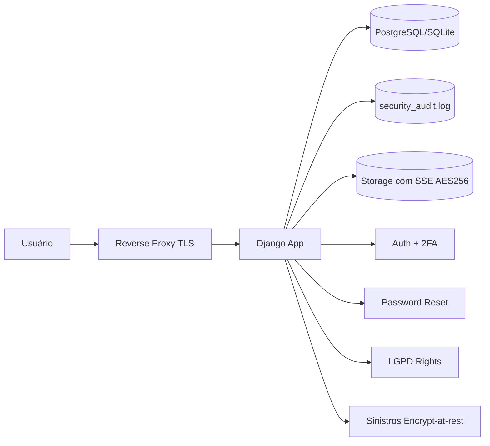
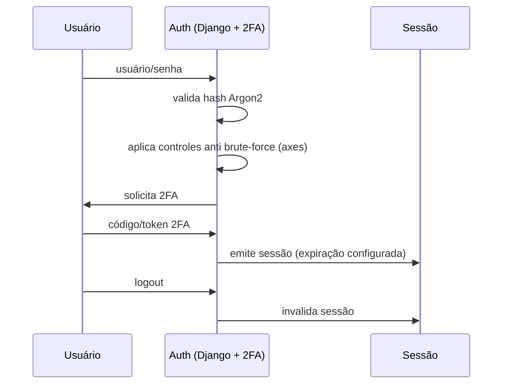
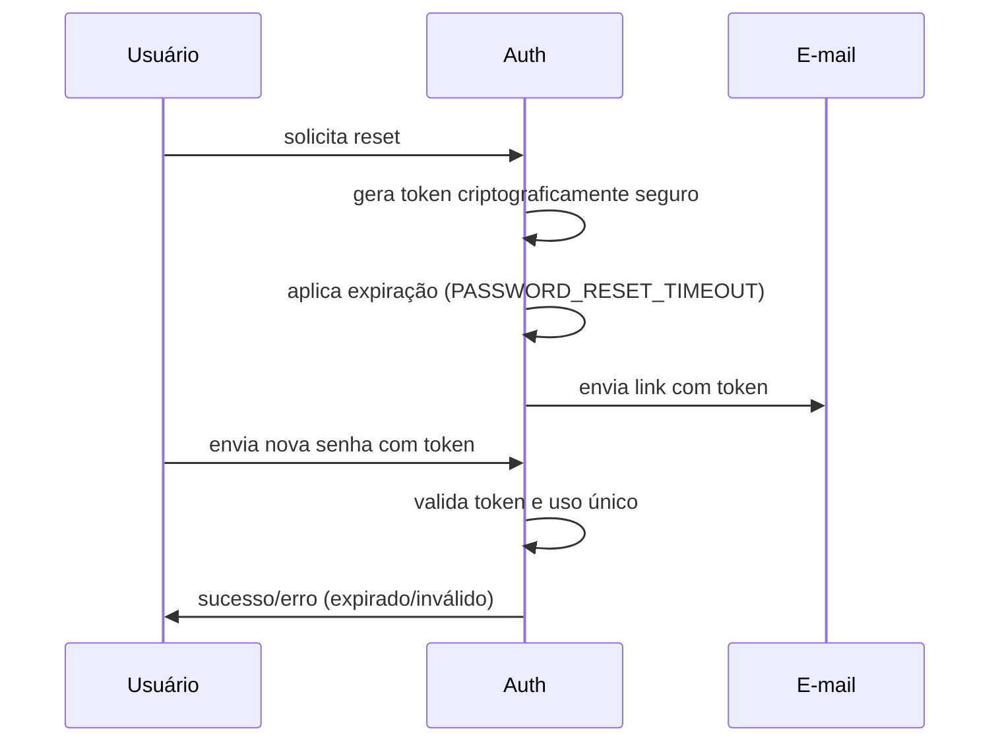
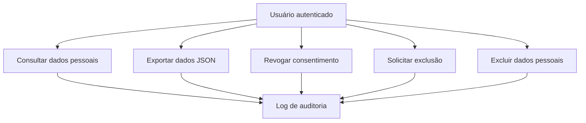

# Arquitetura e fluxos

## Diagrama de arquitetura (lógico)

```mermaid
flowchart LR
  U[Usuário] --> RP[Reverse Proxy TLS]
  RP --> DJ[Django App]
  DJ --> DB[(PostgreSQL/SQLite)]
  DJ --> LOG[(security_audit.log)]
  DJ --> S3[(Storage com SSE AES256)]

  DJ --> A[Auth + 2FA]
  DJ --> R[Password Reset]
  DJ --> L[LGPD Rights]
  DJ --> S[Sinistros Encrypt-at-rest]
```

## Fluxo de autenticação + 2FA

```mermaid
sequenceDiagram
  participant U as Usuário
  participant A as Auth (Django + 2FA)
  participant S as Sessão

  U->>A: usuário/senha
  A->>A: valida hash Argon2
  A->>A: aplica controles anti brute-force (axes)
  A->>U: solicita 2FA
  U->>A: código/token 2FA
  A->>S: emite sessão (expiração configurada)
  U->>A: logout
  A->>S: invalida sessão
```

## Fluxo de recuperação de senha

```mermaid
sequenceDiagram
  participant U as Usuário
  participant A as Auth
  participant M as E-mail

  U->>A: solicita reset
  A->>A: gera token criptograficamente seguro
  A->>A: aplica expiração (PASSWORD_RESET_TIMEOUT)
  A->>M: envia link com token
  U->>A: envia nova senha com token
  A->>A: valida token e uso único
  A->>U: sucesso/erro (expirado/inválido)
```

## Fluxo de direitos do titular (LGPD)

```mermaid
flowchart TD
  A[Usuário autenticado] --> B[Consultar dados pessoais]
  A --> C[Exportar dados JSON]
  A --> D[Revogar consentimento]
  A --> E[Solicitar exclusão]
  A --> F[Excluir dados pessoais]
  B --> G[Log de auditoria]
  C --> G
  D --> G
  E --> G
  F --> G
```
